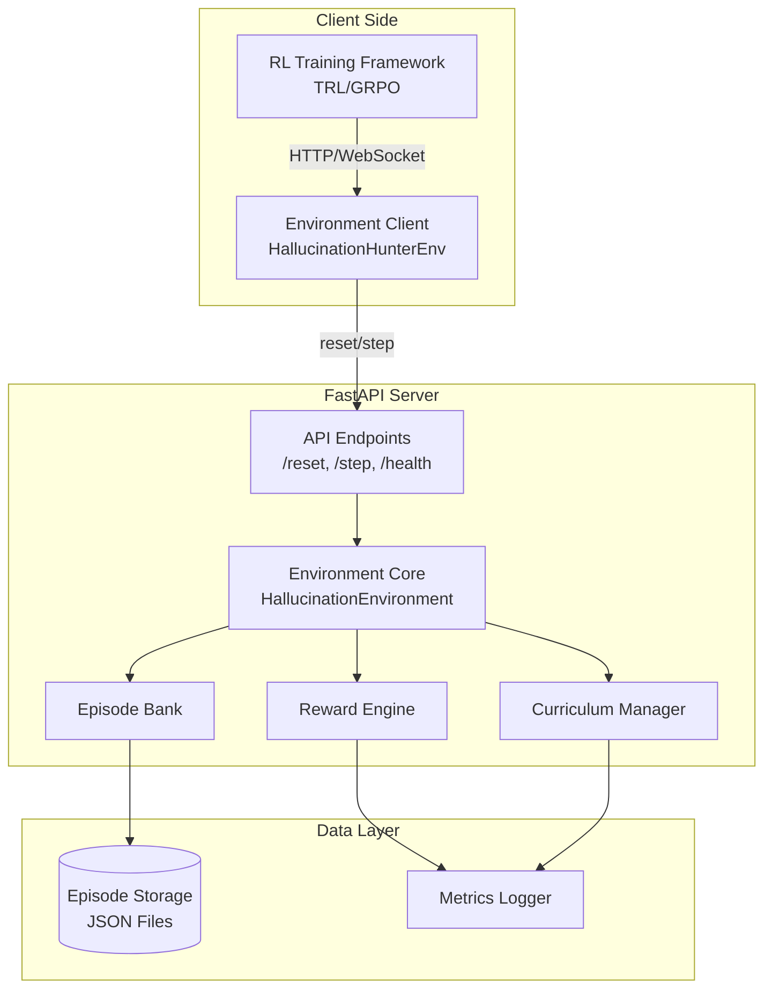

# Design Document: Hallucination Hunter RL Environment

## Overview

The Hallucination Hunter is an OpenEnv-compatible reinforcement learning environment that trains language models to detect hallucinations in LLM-generated text at the claim level. The system provides deterministic rewards based on detection accuracy, implements anti-gaming penalties, and uses curriculum learning to progressively increase difficulty.

### Core Capabilities

- **OpenEnv-Compatible API**: FastAPI server implementing standard `reset()` and `step()` endpoints for seamless integration with RL frameworks
- **Deterministic Reward Engine**: Reproducible scoring without human labeling, based on precision, recall, and correction quality
- **Curriculum Learning**: Progressive difficulty scaling from L1 (simple) to L4 (complex) based on performance thresholds
- **Multi-Source Episode Bank**: 1000+ labeled episodes from HaluEval, TruthfulQA, and synthetic Wikipedia-based data
- **Claim-Level Detection**: Fine-grained hallucination identification with individual claim labeling and correction
- **GRPO Training Support**: Compatible with HuggingFace TRL for Group Relative Policy Optimization with 8 parallel generations

### Key Design Decisions

1. **Single-Turn Episodes**: Each episode consists of one detection task followed by immediate reward calculation, simplifying the RL loop and enabling faster iteration
2. **Claim Decomposition at Preprocessing**: Episodes are decomposed into individual claims during dataset creation rather than runtime, ensuring consistent ground truth labels
3. **Difficulty-Based Multipliers**: Rewards scale with difficulty level (L1: 1.0x, L2: 1.5x, L3: 2.0x, L4: 2.5x) to incentivize progression
4. **Anti-Gaming Penalties**: Explicit penalties for flagging >80% of claims or <5% of claims prevent trivial strategies
5. **JSON Schema Enforcement**: Structured output format with `claim_text`, `label`, `reason`, and `corrected_fact` fields ensures parseable agent responses

## Architecture

### System Components



### Component Responsibilities

**Environment Client (`HallucinationHunterEnv`)**
- Extends OpenEnv `EnvClient` base class
- Manages WebSocket connection to FastAPI server
- Serializes actions and deserializes observations
- Provides synchronous and asynchronous interfaces

**API Endpoints**
- `POST /reset`: Initialize new episode, return observation with LLM-generated text
- `POST /step`: Accept detection output, return reward and done flag
- `GET /health`: Return server status and episode bank statistics
- `GET /docs`: Auto-generated API documentation via FastAPI

**Environment Core (`HallucinationEnvironment`)**
- Extends OpenEnv `Environment` base class
- Orchestrates episode lifecycle
- Delegates to Curriculum Manager for episode sampling
- Delegates to Reward Engine for scoring
- Maintains episode state (current episode, step count, metadata)

**Curriculum Manager**
- Tracks rolling average rewards per difficulty level (window size: 50)
- Implements promotion logic: enable next level when avg reward exceeds threshold
- Samples episodes from currently enabled difficulty levels
- Persists curriculum state for training resumption

**Reward Engine**
- Parses agent detection output JSON
- Matches detected claims to ground truth claims
- Calculates base rewards: TP (+3.0), FP (-2.0), FN (-1.5), TN (+0.5)
- Computes correction bonus via keyword overlap
- Applies calibration bonus when precision and recall both >0.6
- Applies difficulty multiplier
- Enforces anti-gaming penalties

**Episode Bank**
- Loads and stores episodes from multiple datasets
- Assigns difficulty levels based on heuristics (claim count, ambiguity, domain complexity)
- Provides sampling interface with difficulty filtering
- Validates episode structure (source, response, ground truth, claims, labels)

**Metrics Logger**
- Records episode-level metrics: reward, precision, recall, difficulty
- Tracks cumulative statistics over training
- Exports time series data for visualization
- Supports rolling averages with configurable window sizes

## Components and Interfaces

### Data Models

#### Episode
```python
@dataclass
class Claim:
    claim_text: str
    label: str  # "factual", "hallucinated", "unverifiable"
    ground_truth_fact: Optional[str]  # For hallucinated claims
    
@dataclass
class Episode:
    episode_id: str
    source_dataset: str  # "halueval_qa", "truthfulqa", "wikipedia_synthetic"
    difficulty_level: str  # "L1", "L2", "L3", "L4"
    source_text: str  # Original context (e.g., Wikipedia paragraph)
    generated_response: str  # LLM-generated text to analyze
    claims: List[Claim]  # Ground truth claim decomposition
    metadata: Dict[str, Any]  # Additional info (topic, model, etc.)
```

#### Detection Output (Agent Response)
```python
@dataclass
class DetectedClaim:
    claim_text: str
    label: str  # "factual", "hallucinated", "unverifiable"
    reason: str  # Explanation for the label
    corrected_fact: Optional[str]  # Correction if hallucinated
    
@dataclass
class DetectionOutput:
    detected_claims: List[DetectedClaim]
```

#### OpenEnv API Models
```python
@dataclass
class Observation:
    generated_text: str  # The LLM output to analyze
    task_instruction: str  # Instructions for detection task
    
@dataclass
class Action:
    detection_output: DetectionOutput
    
@dataclass
class StepResult:
    observation: Observation
    reward: float
    done: bool
    info: Dict[str, Any]  # Contains difficulty_level, source_dataset, metrics
```

### API Specifications

#### POST /reset
**Request Body**: None (or optional config for episode selection)

**Response**:
```json
{
  "observation": {
    "generated_text": "The Eiffel Tower was built in 1889...",
    "task_instruction": "Identify each factual claim in the text. Label each claim as 'factual', 'hallucinated', or 'unverifiable'. For hallucinated claims, provide the correct fact."
  },
  "info": {
    "episode_id": "ep_001",
    "difficulty_level": "L1",
    "source_dataset": "halueval_qa"
  }
}
```

#### POST /step
**Request Body**:
```json
{
  "action": {
    "detection_output": {
      "detected_claims": [
        {
          "claim_text": "The Eiffel Tower was built in 1889",
          "label": "factual",
          "reason": "Matches historical records",
          "corrected_fact": null
        },
        {
          "claim_text": "It is 400 meters tall",
          "label": "hallucinated",
          "reason": "Actual height is 330 meters",
          "corrected_fact": "The Eiffel Tower is 330 meters tall"
        }
      ]
    }
  }
}
```

**Response**:
```json
{
  "observation": {
    "generated_text": "",
    "task_instruction": ""
  },
  "reward": 4.2,
  "done": true,
  "info": {
    "episode_id": "ep_001",
    "difficulty_level": "L1",
    "precision": 0.85,
    "recall": 0.90,
    "true_positives": 2,
    "false_positives": 1,
    "false_negatives": 0,
    "correction_bonus": 0.7,
    "calibration_bonus": 1.0,
    "difficulty_multiplier": 1.0
  }
}
```

#### GET /health
**Response**:
```json
{
  "status": "healthy",
  "episode_count": 1247,
  "difficulty_distribution": {
    "L1": 312,
    "L2": 415,
    "L3": 320,
    "L4": 200
  },
  "curriculum_state": {
    "enabled_levels": ["L1", "L2"],
    "rolling_avg_rewards": {
      "L1": 3.8,
      "L2": 2.1
    }
  }
}
```

### Curriculum Manager Interface

```python
class CurriculumManager:
    def __init__(self, promotion_thresholds: Dict[str, float], window_size: int = 50):
        """
        promotion_thresholds: {"L1": 3.5, "L2": 4.0, "L3": 5.0}
        window_size: Number of recent episodes for rolling average
        """
        
    def record_reward(self, difficulty_level: str, reward: float) -> None:
        """Record episode reward for curriculum tracking"""
        
    def get_enabled_levels(self) -> List[str]:
        """Return currently enabled difficulty levels"""
        
    def check_promotion(self) -> Optional[str]:
        """Check if any level should be promoted, return newly enabled level"""
        
    def get_rolling_avg(self, difficulty_level: str) -> float:
        """Get rolling average reward for a difficulty level"""
```

### Reward Engine Interface

```python
class RewardEngine:
    def calculate_reward(
        self,
        detection_output: DetectionOutput,
        ground_truth_claims: List[Claim],
        difficulty_level: str
    ) -> Tuple[float, Dict[str, Any]]:
        """
        Returns: (total_reward, metrics_dict)
        
        metrics_dict contains:
        - precision, recall, f1
        - true_positives, false_positives, false_negatives, true_negatives
        - correction_bonus, calibration_bonus
        - difficulty_multiplier
        - penalties (gaming_penalty, passivity_penalty)
        """
        
    def _match_claims(
        self,
        detected: List[DetectedClaim],
        ground_truth: List[Claim]
    ) -> List[Tuple[DetectedClaim, Claim]]:
        """Match detected claims to ground truth using fuzzy string matching"""
        
    def _calculate_correction_bonus(
        self,
        corrected_fact: str,
        ground_truth_fact: str
    ) -> float:
        """Calculate bonus based on keyword overlap (0.0 to 1.0)"""
        
    def _check_gaming_penalty(
        self,
        detection_output: DetectionOutput,
        ground_truth_claims: List[Claim]
    ) -> float:
        """Return penalty if >80% flagged or <5% flagged with known hallucinations"""
```

### Episode Bank Interface

```python
class EpisodeBank:
    def load_episodes(self, data_dir: str) -> None:
        """Load episodes from JSON files in data directory"""
        
    def sample_episode(self, difficulty_levels: List[str]) -> Episode:
        """Sample random episode from enabled difficulty levels"""
        
    def get_episode_by_id(self, episode_id: str) -> Episode:
        """Retrieve specific episode"""
        
    def get_statistics(self) -> Dict[str, Any]:
        """Return episode count and difficulty distribution"""
        
    def _assign_difficulty(self, episode: Episode) -> str:
        """Heuristic to assign L1-L4 based on claim count, ambiguity, etc."""
```

## Data Models

### Episode Storage Format

Episodes are stored as JSON files with the following structure:

```json
{
  "episode_id": "halueval_qa_001",
  "source_dataset": "halueval_qa",
  "difficulty_level": "L2",
  "source_text": "The Eiffel Tower is a wrought-iron lattice tower on the Champ de Mars in Paris, France. It is named after the engineer Gustave Eiffel.",
  "generated_response": "The Eiffel Tower was built in 1889 and stands 400 meters tall. It was designed by Gustave Eiffel and is located in Paris.",
  "claims": [
    {
      "claim_text": "The Eiffel Tower was built in 1889",
      "label": "factual",
      "ground_truth_fact": null
    },
    {
      "claim_text": "It stands 400 meters tall",
      "label": "hallucinated",
      "ground_truth_fact": "The Eiffel Tower is 330 meters tall (including antennas)"
    },
    {
      "claim_text": "It was designed by Gustave Eiffel",
      "label": "factual",
      "ground_truth_fact": null
    },
    {
      "claim_text": "It is located in Paris",
      "label": "factual",
      "ground_truth_fact": null
    }
  ],
  "metadata": {
    "topic": "landmarks",
    "claim_count": 4,
    "hallucination_rate": 0.25,
    "source_model": "gpt-3.5-turbo"
  }
}
```

### Difficulty Level Assignment Heuristics

**L1 (Simple)**
- 2-4 claims per episode
- Single-domain knowledge (e.g., basic facts)
- Clear factual/hallucinated distinction
- Low ambiguity in ground truth

**L2 (Moderate)**
- 4-6 claims per episode
- Cross-domain knowledge
- Some claims require inference
- Moderate ambiguity

**L3 (Hard)**
- 6-8 claims per episode
- Complex multi-hop reasoning
- Subtle hallucinations (e.g., date off by one year)
- Higher ambiguity

**L4 (Expert)**
- 8+ claims per episode
- Specialized domain knowledge
- Mixed factual and unverifiable claims
- Requires deep context understanding

### Metrics Schema

```python
@dataclass
class EpisodeMetrics:
    episode_id: str
    timestamp: float
    difficulty_level: str
    reward: float
    precision: float
    recall: float
    f1_score: float
    true_positives: int
    false_positives: int
    false_negatives: int
    true_negatives: int
    correction_bonus: float
    calibration_bonus: float
    difficulty_multiplier: float
    gaming_penalty: float
    passivity_penalty: float
```

## Correctness Properties

*A property is a characteristic or behavior that should hold true across all valid executions of a system—essentially, a formal statement about what the system should do. Properties serve as the bridge between human-readable specifications and machine-verifiable correctness guarantees.*

### Property Reflection

After analyzing all acceptance criteria, several properties can be consolidated:
- Properties 2.3 and 8.4 both test independent tracking per difficulty level → combined into Property 8
- Properties 8.5 and 12.6 both test export format compatibility → combined into Property 24
- Reward calculation properties (4.1-4.4) test the same reward engine with different inputs → combined into Property 9
- Parser properties (9.1-9.3) test the same parsing logic with different formats → combined into Property 19

### Property 1: Episode Structure Completeness

*For any* episode in the Episode_Bank, it SHALL contain all required fields: episode_id, source_dataset, difficulty_level, source_text, generated_response, claims list, and metadata.

**Validates: Requirements 1.7**

### Property 2: Difficulty Level Validity

*For any* episode stored in the Episode_Bank, the assigned difficulty_level SHALL be one of {"L1", "L2", "L3", "L4"}.

**Validates: Requirements 1.2**

### Property 3: Claim Decomposition Completeness

*For any* generated response processed by the Episode_Bank, the claim decomposition SHALL produce at least one claim, and each claim SHALL have a valid label in {"factual", "hallucinated", "unverifiable"}.

**Validates: Requirements 1.6, 9.5, 9.6**

### Property 4: Curriculum Promotion Threshold

*For any* sequence of episode rewards at a given difficulty level, when the rolling average (window size 50) exceeds the promotion threshold, the Curriculum_Manager SHALL enable the next difficulty level.

**Validates: Requirements 2.2**

### Property 5: Rolling Window Size Invariant

*For any* sequence of rewards longer than 50 episodes, only the most recent 50 rewards SHALL affect the rolling average calculation for promotion decisions.

**Validates: Requirements 2.5**

### Property 6: Curriculum Sampling Constraint

*For any* curriculum state with enabled difficulty levels, sampled episodes SHALL only come from the set of currently enabled levels.

**Validates: Requirements 2.4**

### Property 7: Initial Curriculum State

*For any* new training session, the Curriculum_Manager SHALL initially enable only L1 difficulty level.

**Validates: Requirements 2.1**

### Property 8: Independent Difficulty Tracking

*For any* set of episodes with different difficulty levels, reward statistics SHALL be tracked separately per level such that rewards from one level do not affect statistics of another level.

**Validates: Requirements 2.3, 8.4**

### Property 9: Base Reward Calculation

*For any* detection output, the Reward_Engine SHALL apply the following base rewards: true positive (correctly identified hallucination) = +3.0 points, false positive (incorrectly flagged factual claim) = -2.0 points, false negative (missed hallucination) = -1.5 points, true negative (correctly identified factual claim) = +0.5 points.

**Validates: Requirements 4.1, 4.2, 4.3, 4.4**

### Property 10: Correction Bonus Monotonicity

*For any* pair of corrections for the same hallucinated claim, if correction A has higher keyword overlap with the ground truth than correction B, then correction A SHALL receive a higher or equal correction bonus.

**Validates: Requirements 4.5**

### Property 11: Calibration Bonus Threshold

*For any* detection output, the Reward_Engine SHALL award a calibration bonus of exactly 1.0 points if and only if both precision and recall exceed 0.6.

**Validates: Requirements 4.6**

### Property 12: Difficulty Multiplier Application

*For any* episode at difficulty level L, the total reward SHALL be multiplied by the difficulty multiplier: L1 → 1.0x, L2 → 1.5x, L3 → 2.0x, L4 → 2.5x.

**Validates: Requirements 4.7**

### Property 13: Anti-Gaming Dominance

*For any* episode, the total reward from flagging all claims as hallucinated SHALL be strictly less than the total reward from flagging no claims as hallucinated.

**Validates: Requirements 4.8**

### Property 14: Gaming Penalty Threshold

*For any* detection output where more than 80% of claims are flagged as hallucinated, the Reward_Engine SHALL apply a gaming penalty of exactly -5.0 points.

**Validates: Requirements 5.1**

### Property 15: Passivity Penalty Threshold

*For any* episode containing at least one hallucinated claim, if the detection output flags fewer than 5% of claims as hallucinated, the Reward_Engine SHALL apply a passivity penalty of exactly -3.0 points.

**Validates: Requirements 5.2**

### Property 16: Selective Flagging Optimality

*For any* episode with both factual and hallucinated claims, selective flagging (identifying only the hallucinated claims) SHALL produce a higher total reward than either flagging all claims or flagging no claims.

**Validates: Requirements 5.4**

### Property 17: Reset Observation Structure

*For any* reset call to the Environment, the response SHALL contain an observation with generated_text and task_instruction fields, plus an info dictionary with episode_id, difficulty_level, and source_dataset.

**Validates: Requirements 3.1, 6.2**

### Property 18: Task Instruction Completeness

*For any* episode observation, the task_instruction SHALL mention: (1) identifying factual claims, (2) labeling claims as factual/hallucinated/unverifiable, (3) providing corrections for hallucinated claims, (4) JSON output format, and (5) required fields (claim_text, label, reason, corrected_fact).

**Validates: Requirements 3.2, 3.3, 3.4, 3.5, 3.6**

### Property 19: Dataset Parser Validity

*For any* valid input from HaluEval, TruthfulQA, or Wikipedia-based synthetic datasets, the corresponding parser SHALL produce a valid Episode with all required fields and at least one claim.

**Validates: Requirements 9.1, 9.2, 9.3, 9.4**

### Property 20: Step Response Structure

*For any* step call to the Environment with a detection output, the response SHALL contain reward (float), observation (dict), done (bool), and info (dict with precision, recall, and confusion matrix metrics).

**Validates: Requirements 6.3**

### Property 21: Single-Turn Episode Completion

*For any* episode, after the first step call, the done flag SHALL be set to true, indicating episode completion.

**Validates: Requirements 6.4, 6.5**

### Property 22: Independent Scoring for Parallel Generations

*For any* set of different detection outputs submitted for the same episode, each detection output SHALL receive an independently calculated reward based solely on its own accuracy.

**Validates: Requirements 7.2**

### Property 23: Episode Interaction Logging

*For any* episode interaction (reset or step), the Environment SHALL create a log entry containing timestamp, episode_id, reward (if applicable), and agent output (if applicable).

**Validates: Requirements 7.5**

### Property 24: Precision and Recall Calculation

*For any* detection output, precision SHALL equal TP/(TP+FP) and recall SHALL equal TP/(TP+FN), where TP, FP, and FN are calculated by matching detected claims to ground truth claims.

**Validates: Requirements 8.1, 8.2**

### Property 25: Cumulative Reward Tracking

*For any* sequence of N episodes, the cumulative reward SHALL equal the sum of individual episode rewards.

**Validates: Requirements 8.3**

### Property 26: Rolling Average Calculation

*For any* metric sequence and window size W, the rolling average at position i SHALL equal the mean of the W most recent values up to position i.

**Validates: Requirements 8.6**

### Property 27: Metrics Export Format

*For any* metrics export operation, the output SHALL be in JSON format parseable by standard plotting libraries (matplotlib, plotly, etc.).

**Validates: Requirements 8.5, 12.6**

### Property 28: Health Endpoint Response

*For any* health check request, the response SHALL contain status (string) and episode_count (integer) fields.

**Validates: Requirements 11.2**

### Property 29: Rate Limiting Enforcement

*For any* burst of requests exceeding the configured rate limit, the Environment SHALL reject requests with HTTP 429 status until the rate falls below the limit.

**Validates: Requirements 11.5**

### Property 30: Visualization Data Completeness

*For any* training run with N episodes, the exported visualization data SHALL contain time series for: reward per difficulty level, precision over steps, recall over steps, and cumulative reward.

**Validates: Requirements 12.1, 12.2**

### Property 31: Comparison Mode Metrics

*For any* comparison between untrained and trained models, the aggregate metrics SHALL include all six values: baseline_reward, trained_reward, baseline_precision, baseline_recall, trained_precision, and trained_recall.

**Validates: Requirements 12.5**

### Property 32: Detection Output Diff Generation

*For any* pair of detection outputs (baseline and trained), the diff generation SHALL highlight claims that differ in label or corrected_fact between the two outputs.

**Validates: Requirements 12.4**

## Error Handling

### Input Validation Errors

**Invalid Detection Output Format**
- **Trigger**: Agent submits malformed JSON or missing required fields
- **Handling**: Return HTTP 400 with detailed error message specifying which fields are missing or invalid
- **Recovery**: Agent can retry with corrected format; episode state is preserved

**Claim Matching Failures**
- **Trigger**: Agent's detected claims cannot be matched to ground truth claims (e.g., completely unrelated text)
- **Handling**: Log warning, treat unmatched detected claims as false positives, treat unmatched ground truth claims as false negatives
- **Recovery**: Reward calculation proceeds with available matches; episode completes normally

**Invalid Label Values**
- **Trigger**: Agent provides label outside {"factual", "hallucinated", "unverifiable"}
- **Handling**: Return HTTP 400 with error message listing valid labels
- **Recovery**: Agent retries with valid labels

### Episode Bank Errors

**Empty Episode Bank**
- **Trigger**: Episode bank contains zero episodes at initialization
- **Handling**: Raise initialization error, prevent server startup
- **Recovery**: Administrator must load episodes before starting server

**Missing Difficulty Level**
- **Trigger**: Curriculum requests episodes from a difficulty level with zero episodes
- **Handling**: Log warning, sample from available difficulty levels instead
- **Recovery**: Training continues with available episodes; curriculum progression may be affected

**Corrupted Episode Data**
- **Trigger**: Episode file is malformed or missing required fields
- **Handling**: Log error with episode_id, skip episode during loading
- **Recovery**: Server starts with remaining valid episodes; corrupted episodes are excluded

### Curriculum Errors

**Promotion Threshold Never Met**
- **Trigger**: Agent performance plateaus below promotion threshold
- **Handling**: Continue sampling from current difficulty level indefinitely
- **Recovery**: Training continues; manual threshold adjustment may be needed

**Reward Tracking Overflow**
- **Trigger**: Rolling window accumulates extreme reward values
- **Handling**: Use floating-point arithmetic with sufficient precision; log warning if values exceed expected range
- **Recovery**: Calculation continues; consider reward normalization if issue persists

### Concurrency Errors

**Race Condition in Episode Sampling**
- **Trigger**: Multiple clients request episodes simultaneously
- **Handling**: Use thread-safe sampling with locks or atomic operations
- **Recovery**: Each client receives a valid episode; no data corruption

**Concurrent Curriculum Updates**
- **Trigger**: Multiple episodes complete simultaneously, triggering promotion checks
- **Handling**: Serialize curriculum updates with locks; only one promotion check at a time
- **Recovery**: Curriculum state remains consistent; all rewards are recorded

### External Integration Errors

**TRL Client Connection Failure**
- **Trigger**: Network error or server unavailable during training
- **Handling**: Client retries with exponential backoff (max 3 attempts)
- **Recovery**: If retries fail, raise exception to training loop; training can resume from last checkpoint

**Logging System Failure**
- **Trigger**: Disk full or permissions error when writing logs
- **Handling**: Log to stderr, continue episode processing without persisting logs
- **Recovery**: Training continues; logs may be incomplete

**Metrics Export Failure**
- **Trigger**: Invalid file path or permissions error during export
- **Handling**: Raise exception with detailed error message
- **Recovery**: User corrects path/permissions and retries export; metrics remain in memory

### Deployment Errors

**HuggingFace Spaces Resource Limits**
- **Trigger**: Episode bank or model exceeds memory limits
- **Handling**: Reduce episode bank size or use disk-based storage; implement lazy loading
- **Recovery**: Redeploy with optimized resource usage

**Rate Limit Exceeded**
- **Trigger**: Client exceeds configured request rate
- **Handling**: Return HTTP 429 with Retry-After header
- **Recovery**: Client waits and retries; no data loss

## Testing Strategy

### Unit Testing

**Reward Engine Tests**
- Test each reward component in isolation: base rewards, correction bonus, calibration bonus, difficulty multiplier, penalties
- Test edge cases: zero claims, all factual, all hallucinated, empty corrections
- Test boundary conditions: exactly 80% flagged, exactly 5% flagged, precision/recall exactly 0.6
- Verify anti-gaming property: flag-all scores lower than flag-none for all episode types

**Curriculum Manager Tests**
- Test promotion logic with various reward sequences
- Test rolling window calculation with sequences of different lengths
- Test initial state (only L1 enabled)
- Test boundary conditions: reward exactly at threshold, just below threshold, just above threshold

**Episode Bank Tests**
- Test episode loading from JSON files
- Test difficulty assignment heuristics for various episode structures
- Test sampling with different enabled difficulty levels
- Test validation of episode structure

**Parser Tests**
- Test HaluEval parser with valid and invalid inputs
- Test TruthfulQA parser with valid and invalid inputs
- Test Wikipedia parser with valid and invalid inputs
- Test claim extraction with various text structures

**Metrics Calculation Tests**
- Test precision calculation: TP/(TP+FP) for various confusion matrices
- Test recall calculation: TP/(TP+FN) for various confusion matrices
- Test cumulative reward tracking over sequences
- Test rolling average calculation with different window sizes

### Property-Based Testing

**Property Testing Configuration**
- Framework: Hypothesis (Python)
- Minimum iterations: 100 per property
- Tag format: `# Feature: hallucination-hunter, Property {N}: {property_text}`

**Property Test Implementation**

Each of the 32 correctness properties SHALL be implemented as a property-based test:

1. **Property 1-3**: Generate random episodes with varying structures, verify completeness and validity
2. **Property 4-8**: Generate random reward sequences and curriculum states, verify promotion and tracking logic
3. **Property 9-16**: Generate random detection outputs and ground truth, verify reward calculation correctness
4. **Property 17-18**: Generate random episodes, verify observation structure and instruction completeness
5. **Property 19**: Generate random dataset inputs, verify parser produces valid episodes
6. **Property 20-21**: Generate random detection outputs, verify step response structure and completion
7. **Property 22-23**: Generate random parallel generations, verify independent scoring and logging
8. **Property 24-27**: Generate random detection outputs, verify metrics calculation and export
9. **Property 28-29**: Generate random health checks and request bursts, verify responses and rate limiting
10. **Property 30-32**: Generate random training runs, verify visualization data and comparison metrics

**Example Property Test**:
```python
from hypothesis import given, strategies as st

# Feature: hallucination-hunter, Property 9: Base Reward Calculation
@given(
    true_positives=st.integers(min_value=0, max_value=10),
    false_positives=st.integers(min_value=0, max_value=10),
    false_negatives=st.integers(min_value=0, max_value=10),
    true_negatives=st.integers(min_value=0, max_value=10)
)
def test_base_reward_calculation(true_positives, false_positives, false_negatives, true_negatives):
    """For any detection output, base rewards should be: TP=+3.0, FP=-2.0, FN=-1.5, TN=+0.5"""
    detection_output = create_detection_output(true_positives, false_positives, false_negatives, true_negatives)
    ground_truth = create_ground_truth(true_positives, false_positives, false_negatives, true_negatives)
    
    reward, metrics = reward_engine.calculate_reward(detection_output, ground_truth, "L1")
    
    expected_base = (true_positives * 3.0) + (false_positives * -2.0) + (false_negatives * -1.5) + (true_negatives * 0.5)
    
    # Base reward should match expected (before bonuses/penalties/multipliers)
    assert metrics['base_reward'] == expected_base
```

### Integration Testing

**End-to-End Training Flow**
- Test complete training loop: reset → step → reward → curriculum update → next episode
- Test with mock agent generating various detection outputs
- Verify curriculum progression from L1 to L4 over simulated training
- Verify metrics accumulation and export

**TRL Integration**
- Test Environment client with actual TRL GRPO trainer
- Test 8 parallel generations per prompt
- Verify reward signals are correctly passed to TRL
- Test training convergence on small episode subset

**API Endpoint Integration**
- Test /reset endpoint with various configurations
- Test /step endpoint with valid and invalid detection outputs
- Test /health endpoint returns correct statistics
- Test concurrent requests from multiple clients
- Test rate limiting behavior under load

**Dataset Integration**
- Test loading actual HaluEval dataset
- Test loading actual TruthfulQA dataset
- Test generating synthetic Wikipedia episodes
- Verify episode bank reaches 1000+ episodes
- Verify difficulty distribution is reasonable

### Smoke Testing

**Deployment Smoke Tests**
- Verify server starts successfully on HuggingFace Spaces
- Verify /health endpoint returns 200 status
- Verify /docs endpoint serves API documentation
- Verify episode bank loads from persistent storage
- Verify at least 1000 episodes are available
- Verify all difficulty levels (L1-L4) have episodes

**Configuration Smoke Tests**
- Verify promotion thresholds are set correctly
- Verify difficulty multipliers are configured
- Verify rate limiting is enabled
- Verify logging is functional

### Performance Testing

**Load Testing**
- Test 100 concurrent clients making reset/step requests
- Verify response times remain under 500ms at p95
- Verify no memory leaks over 10,000 episodes
- Verify rate limiting prevents server overload

**Scalability Testing**
- Test with episode banks of varying sizes: 1K, 5K, 10K episodes
- Verify sampling performance remains constant
- Verify memory usage scales linearly with episode count

### Comparison Testing

**Baseline vs Trained Model**
- Evaluate untrained model on 100 test episodes
- Train model for N steps
- Evaluate trained model on same 100 test episodes
- Verify trained model achieves higher reward, precision, and recall
- Generate before-and-after visualizations

**Expected Improvements**
- Baseline reward: ~0.5 (random guessing with penalties)
- Trained reward: >3.0 (selective detection)
- Baseline precision: ~0.3-0.5
- Trained precision: >0.7
- Baseline recall: ~0.3-0.5
- Trained recall: >0.7

### Test Coverage Goals

- Unit test coverage: >90% of reward engine, curriculum manager, episode bank, parsers
- Property test coverage: 100% of 32 correctness properties
- Integration test coverage: All API endpoints, TRL integration, dataset loading
- Smoke test coverage: All deployment requirements
- Performance test coverage: Concurrency, scalability, rate limiting


## Implementation Approach

### Technology Stack

**Backend**
- FastAPI 0.104+ for OpenEnv-compatible API server
- Pydantic 2.0+ for data validation and serialization
- Python 3.10+ for type hints and modern syntax

**RL Integration**
- HuggingFace TRL for GRPO training
- OpenEnv protocol for environment interface
- WebSocket support for low-latency communication

**Data Processing**
- spaCy 3.7+ for claim extraction (sentence segmentation, dependency parsing)
- NLTK for text preprocessing
- FuzzyWuzzy for claim matching and keyword overlap calculation

**Testing**
- Hypothesis for property-based testing
- pytest for unit and integration tests
- pytest-asyncio for async endpoint testing

**Deployment**
- HuggingFace Spaces for hosting
- Docker for containerization
- Uvicorn as ASGI server

**Model Training**
- Qwen2.5-7B-Instruct as base model
- Unsloth for 4-bit quantization
- LoRA for parameter-efficient fine-tuning
- GRPO with 8 generations per prompt

### Project Structure

```
hallucination-hunter/
├── src/
│   ├── environment/
│   │   ├── __init__.py
│   │   ├── core.py              # HallucinationEnvironment class
│   │   ├── curriculum.py        # CurriculumManager class
│   │   ├── reward.py            # RewardEngine class
│   │   └── episode_bank.py      # EpisodeBank class
│   ├── parsers/
│   │   ├── __init__.py
│   │   ├── halueval.py          # HaluEval dataset parser
│   │   ├── truthfulqa.py        # TruthfulQA dataset parser
│   │   └── wikipedia.py         # Wikipedia synthetic parser
│   ├── client/
│   │   ├── __init__.py
│   │   └── env_client.py        # HallucinationHunterEnv client wrapper
│   ├── api/
│   │   ├── __init__.py
│   │   ├── server.py            # FastAPI application
│   │   └── models.py            # Pydantic models for API
│   └── utils/
│       ├── __init__.py
│       ├── claim_extraction.py  # Claim decomposition logic
│       ├── metrics.py           # Metrics calculation and logging
│       └── matching.py          # Fuzzy claim matching
├── data/
│   ├── episodes/
│   │   ├── halueval/            # HaluEval episodes (JSON)
│   │   ├── truthfulqa/          # TruthfulQA episodes (JSON)
│   │   └── wikipedia/           # Wikipedia synthetic episodes (JSON)
│   └── raw/                     # Raw dataset files
├── tests/
│   ├── unit/
│   │   ├── test_reward_engine.py
│   │   ├── test_curriculum.py
│   │   ├── test_episode_bank.py
│   │   └── test_parsers.py
│   ├── property/
│   │   ├── test_properties_1_10.py
│   │   ├── test_properties_11_20.py
│   │   └── test_properties_21_32.py
│   ├── integration/
│   │   ├── test_api_endpoints.py
│   │   ├── test_training_flow.py
│   │   └── test_trl_integration.py
│   └── smoke/
│       └── test_deployment.py
├── scripts/
│   ├── preprocess_datasets.py   # Convert raw datasets to episodes
│   ├── train_agent.py           # Training script with TRL
│   ├── evaluate.py              # Evaluation and comparison script
│   └── visualize.py             # Generate plots and visualizations
├── configs/
│   ├── curriculum.yaml          # Promotion thresholds and window size
│   ├── rewards.yaml             # Reward values and multipliers
│   └── deployment.yaml          # HuggingFace Spaces configuration
├── Dockerfile
├── requirements.txt
├── README.md
└── app.py                       # Entry point for HuggingFace Spaces
```

### Implementation Phases

#### Phase 1: Core Environment (Week 1)
1. Implement Episode and Claim data models
2. Implement EpisodeBank with loading and sampling
3. Implement RewardEngine with base reward calculation
4. Implement CurriculumManager with promotion logic
5. Implement HallucinationEnvironment core class
6. Write unit tests for all components

#### Phase 2: Data Preprocessing (Week 1)
1. Implement HaluEval parser
2. Implement TruthfulQA parser
3. Implement Wikipedia synthetic episode generator
4. Implement claim extraction using spaCy
5. Preprocess datasets to create 1000+ episodes
6. Assign difficulty levels to all episodes
7. Write parser unit tests

#### Phase 3: API Server (Week 2)
1. Implement FastAPI server with /reset and /step endpoints
2. Implement /health endpoint with statistics
3. Implement rate limiting middleware
4. Implement request/response validation with Pydantic
5. Add API documentation with examples
6. Write API integration tests

#### Phase 4: Client Wrapper (Week 2)
1. Implement HallucinationHunterEnv client class
2. Implement WebSocket communication
3. Implement synchronous and asynchronous interfaces
4. Add TRL compatibility layer
5. Write client integration tests

#### Phase 5: Metrics and Logging (Week 2)
1. Implement metrics calculation (precision, recall, F1)
2. Implement metrics logging to JSON files
3. Implement rolling average calculation
4. Implement visualization data export
5. Implement comparison mode
6. Write metrics unit tests

#### Phase 6: Property-Based Testing (Week 3)
1. Implement Hypothesis strategies for episodes, detection outputs, rewards
2. Write property tests for Properties 1-10
3. Write property tests for Properties 11-20
4. Write property tests for Properties 21-32
5. Verify all properties pass with 100+ iterations

#### Phase 7: Training Integration (Week 3)
1. Implement training script with TRL GRPO
2. Configure Qwen2.5-7B-Instruct with Unsloth and LoRA
3. Test 8 parallel generations per prompt
4. Implement checkpoint saving and loading
5. Run training for 1000 steps on full episode bank
6. Verify curriculum progression from L1 to L4

#### Phase 8: Deployment (Week 4)
1. Create Dockerfile for HuggingFace Spaces
2. Configure deployment settings (memory, CPU, rate limits)
3. Deploy to HuggingFace Spaces
4. Run smoke tests on deployed instance
5. Load test with concurrent clients
6. Monitor performance and optimize if needed

#### Phase 9: Evaluation and Visualization (Week 4)
1. Evaluate untrained baseline model
2. Evaluate trained model after 1000 steps
3. Generate reward curves per difficulty level
4. Generate precision/recall curves
5. Generate before-and-after detection examples
6. Create comparison visualizations
7. Document results in README

### Key Implementation Details

#### Claim Extraction Algorithm

```python
def extract_claims(text: str) -> List[str]:
    """
    Extract individual factual claims from text using spaCy.
    
    Strategy:
    1. Sentence segmentation to split text into sentences
    2. Dependency parsing to identify independent clauses
    3. Split compound sentences at coordinating conjunctions (and, but, or)
    4. Filter out questions and imperatives (keep only declarative statements)
    5. Return list of claim strings
    """
    doc = nlp(text)
    claims = []
    
    for sent in doc.sents:
        # Split on coordinating conjunctions
        clauses = split_on_conjunctions(sent)
        
        for clause in clauses:
            # Keep only declarative statements
            if is_declarative(clause):
                claims.append(clause.text.strip())
    
    return claims
```

#### Claim Matching Algorithm

```python
def match_claims(
    detected: List[DetectedClaim],
    ground_truth: List[Claim]
) -> List[Tuple[DetectedClaim, Claim]]:
    """
    Match detected claims to ground truth using fuzzy string matching.
    
    Strategy:
    1. Calculate pairwise similarity scores using FuzzyWuzzy ratio
    2. Use Hungarian algorithm for optimal bipartite matching
    3. Only match pairs with similarity > 70%
    4. Return list of matched pairs
    """
    # Build similarity matrix
    similarity_matrix = np.zeros((len(detected), len(ground_truth)))
    for i, det in enumerate(detected):
        for j, gt in enumerate(ground_truth):
            similarity_matrix[i, j] = fuzz.ratio(det.claim_text, gt.claim_text)
    
    # Find optimal matching
    row_ind, col_ind = linear_sum_assignment(-similarity_matrix)
    
    # Filter by threshold
    matches = []
    for i, j in zip(row_ind, col_ind):
        if similarity_matrix[i, j] > 70:
            matches.append((detected[i], ground_truth[j]))
    
    return matches
```

#### Correction Bonus Calculation

```python
def calculate_correction_bonus(corrected_fact: str, ground_truth_fact: str) -> float:
    """
    Calculate correction bonus based on keyword overlap.
    
    Strategy:
    1. Tokenize both strings and remove stopwords
    2. Calculate Jaccard similarity: |intersection| / |union|
    3. Return similarity score (0.0 to 1.0)
    """
    corrected_tokens = set(tokenize_and_remove_stopwords(corrected_fact))
    ground_truth_tokens = set(tokenize_and_remove_stopwords(ground_truth_fact))
    
    if not ground_truth_tokens:
        return 0.0
    
    intersection = corrected_tokens & ground_truth_tokens
    union = corrected_tokens | ground_truth_tokens
    
    return len(intersection) / len(union) if union else 0.0
```

#### Reward Calculation Formula

```python
def calculate_reward(
    detection_output: DetectionOutput,
    ground_truth_claims: List[Claim],
    difficulty_level: str
) -> Tuple[float, Dict[str, Any]]:
    """
    Calculate total reward with all components.
    
    Formula:
    total_reward = (base_reward + correction_bonus + calibration_bonus + penalties) * difficulty_multiplier
    
    Where:
    - base_reward = (TP * 3.0) + (FP * -2.0) + (FN * -1.5) + (TN * 0.5)
    - correction_bonus = sum of keyword overlap scores for corrected hallucinations
    - calibration_bonus = 1.0 if (precision > 0.6 AND recall > 0.6) else 0.0
    - penalties = gaming_penalty + passivity_penalty
    - gaming_penalty = -5.0 if (flagged_rate > 0.8) else 0.0
    - passivity_penalty = -3.0 if (flagged_rate < 0.05 AND has_hallucinations) else 0.0
    - difficulty_multiplier = {L1: 1.0, L2: 1.5, L3: 2.0, L4: 2.5}[difficulty_level]
    """
    # Match claims
    matches = match_claims(detection_output.detected_claims, ground_truth_claims)
    
    # Calculate confusion matrix
    tp, fp, fn, tn = calculate_confusion_matrix(matches, detection_output, ground_truth_claims)
    
    # Base reward
    base_reward = (tp * 3.0) + (fp * -2.0) + (fn * -1.5) + (tn * 0.5)
    
    # Correction bonus
    correction_bonus = sum(
        calculate_correction_bonus(det.corrected_fact, gt.ground_truth_fact)
        for det, gt in matches
        if gt.label == "hallucinated" and det.corrected_fact
    )
    
    # Calibration bonus
    precision = tp / (tp + fp) if (tp + fp) > 0 else 0.0
    recall = tp / (tp + fn) if (tp + fn) > 0 else 0.0
    calibration_bonus = 1.0 if (precision > 0.6 and recall > 0.6) else 0.0
    
    # Penalties
    flagged_rate = sum(1 for det in detection_output.detected_claims if det.label == "hallucinated") / len(detection_output.detected_claims)
    has_hallucinations = any(claim.label == "hallucinated" for claim in ground_truth_claims)
    
    gaming_penalty = -5.0 if flagged_rate > 0.8 else 0.0
    passivity_penalty = -3.0 if (flagged_rate < 0.05 and has_hallucinations) else 0.0
    
    # Difficulty multiplier
    multipliers = {"L1": 1.0, "L2": 1.5, "L3": 2.0, "L4": 2.5}
    difficulty_multiplier = multipliers[difficulty_level]
    
    # Total reward
    total_reward = (base_reward + correction_bonus + calibration_bonus + gaming_penalty + passivity_penalty) * difficulty_multiplier
    
    return total_reward, {
        "base_reward": base_reward,
        "correction_bonus": correction_bonus,
        "calibration_bonus": calibration_bonus,
        "gaming_penalty": gaming_penalty,
        "passivity_penalty": passivity_penalty,
        "difficulty_multiplier": difficulty_multiplier,
        "precision": precision,
        "recall": recall,
        "true_positives": tp,
        "false_positives": fp,
        "false_negatives": fn,
        "true_negatives": tn
    }
```

#### Curriculum Promotion Thresholds

```yaml
# configs/curriculum.yaml
promotion_thresholds:
  L1: 3.5  # Enable L2 when L1 rolling avg > 3.5
  L2: 4.0  # Enable L3 when L2 rolling avg > 4.0
  L3: 5.0  # Enable L4 when L3 rolling avg > 5.0

window_size: 50  # Rolling average window

initial_level: L1  # Start with only L1 enabled
```

### Deployment Configuration

#### HuggingFace Spaces Configuration

```yaml
# configs/deployment.yaml
title: Hallucination Hunter RL Environment
emoji: 🎯
colorFrom: blue
colorTo: purple
sdk: docker
pinned: false
license: mit

hardware:
  cpu: 4
  memory: 16GB
  storage: 10GB

environment:
  EPISODE_BANK_PATH: /data/episodes
  LOG_LEVEL: INFO
  RATE_LIMIT_PER_MINUTE: 60
  MAX_CONCURRENT_REQUESTS: 10
```

#### Dockerfile

```dockerfile
FROM python:3.10-slim

WORKDIR /app

# Install system dependencies
RUN apt-get update && apt-get install -y \
    build-essential \
    && rm -rf /var/lib/apt/lists/*

# Install Python dependencies
COPY requirements.txt .
RUN pip install --no-cache-dir -r requirements.txt

# Download spaCy model
RUN python -m spacy download en_core_web_sm

# Copy application code
COPY src/ ./src/
COPY data/ ./data/
COPY configs/ ./configs/
COPY app.py .

# Expose port
EXPOSE 7860

# Run server
CMD ["uvicorn", "app:app", "--host", "0.0.0.0", "--port", "7860"]
```

#### Entry Point (app.py)

```python
from fastapi import FastAPI
from src.api.server import create_app
from src.environment.episode_bank import EpisodeBank
from src.environment.curriculum import CurriculumManager
from src.environment.reward import RewardEngine
from src.environment.core import HallucinationEnvironment

# Initialize components
episode_bank = EpisodeBank()
episode_bank.load_episodes("data/episodes")

curriculum_manager = CurriculumManager(
    promotion_thresholds={"L1": 3.5, "L2": 4.0, "L3": 5.0},
    window_size=50
)

reward_engine = RewardEngine()

environment = HallucinationEnvironment(
    episode_bank=episode_bank,
    curriculum_manager=curriculum_manager,
    reward_engine=reward_engine
)

# Create FastAPI app
app = create_app(environment)

if __name__ == "__main__":
    import uvicorn
    uvicorn.run(app, host="0.0.0.0", port=7860)
```

### Training Configuration

#### GRPO Training Script

```python
# scripts/train_agent.py
from transformers import AutoTokenizer, AutoModelForCausalLM
from trl import GRPOConfig, GRPOTrainer
from unsloth import FastLanguageModel
from src.client.env_client import HallucinationHunterEnv

# Load model with Unsloth 4-bit quantization
model, tokenizer = FastLanguageModel.from_pretrained(
    model_name="Qwen/Qwen2.5-7B-Instruct",
    max_seq_length=2048,
    dtype=None,
    load_in_4bit=True,
)

# Add LoRA adapters
model = FastLanguageModel.get_peft_model(
    model,
    r=16,
    target_modules=["q_proj", "k_proj", "v_proj", "o_proj"],
    lora_alpha=16,
    lora_dropout=0.05,
    bias="none",
    use_gradient_checkpointing=True,
)

# Initialize environment client
env = HallucinationHunterEnv(server_url="http://localhost:7860")

# Configure GRPO
config = GRPOConfig(
    num_generations=8,  # 8 parallel generations per prompt
    learning_rate=1e-5,
    batch_size=4,
    gradient_accumulation_steps=4,
    max_steps=1000,
    logging_steps=10,
    save_steps=100,
    output_dir="./checkpoints",
)

# Create trainer
trainer = GRPOTrainer(
    model=model,
    tokenizer=tokenizer,
    config=config,
    env=env,
)

# Train
trainer.train()

# Save final model
model.save_pretrained("./final_model")
tokenizer.save_pretrained("./final_model")
```

## Summary

This design document specifies a complete OpenEnv-compatible RL environment for training language models to detect hallucinations at the claim level. The system provides:

1. **Deterministic Rewards**: Reproducible scoring based on detection accuracy, correction quality, and balanced precision/recall
2. **Curriculum Learning**: Progressive difficulty scaling from L1 to L4 based on performance thresholds
3. **Anti-Gaming Mechanisms**: Explicit penalties prevent trivial strategies like flagging everything or nothing
4. **Multi-Source Episodes**: 1000+ labeled episodes from HaluEval, TruthfulQA, and synthetic Wikipedia data
5. **OpenEnv Compatibility**: Standard FastAPI server with reset/step endpoints for seamless RL framework integration
6. **Comprehensive Testing**: 32 correctness properties verified through property-based testing with 100+ iterations each
7. **Production Deployment**: HuggingFace Spaces deployment with rate limiting, health checks, and API documentation

The implementation follows a phased approach over 4 weeks, with clear milestones for core environment, data preprocessing, API server, client wrapper, metrics, property testing, training integration, deployment, and evaluation. The reward calculation formula balances multiple objectives (precision, recall, correction quality) while preventing gaming through carefully designed penalties and the anti-gaming dominance property (Property 13).
